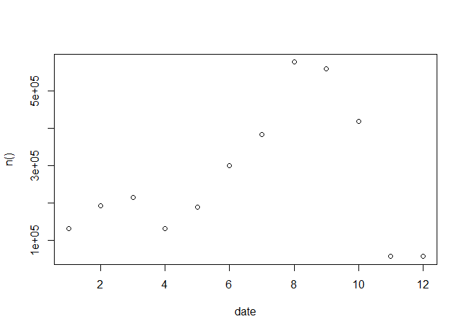
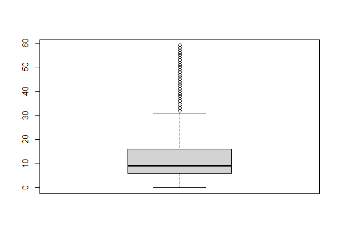

Slovenske železnice train delay
================

- [Data import](#data-import)
- [Representation of data](#representation-of-data)
  - [Network visualization](#network-visualization)

## Data import

Data import and preprocessing.

Data accessible on <https://www.kaggle.com/datasets/gregorkrz/szdelays>

``` r
delays <- read_csv(unzip("train_delay.zip", "delays.csv"))
rail_edge <- read_csv(unzip("train_delay.zip", "rail_edgelist.csv"), col_names = FALSE)
rail_node <- read_csv(unzip("train_delay.zip", "rail_nodes.csv"))

# transform node and edge data to character
rail_node$id <- as.character(rail_node$id)
rail_edge$X1 <- as.character(rail_edge$X1)
rail_edge$X2 <- as.character(rail_edge$X2)
delays$station_id <- as.character(delays$station_id)

# add 0 at begining for 4 letter edges to match the rest
rail_edge$X1[nchar(rail_edge$X1)==4] <- rail_edge$X1[nchar(rail_edge$X1)==4] %>% paste0("0",.)
rail_edge$X2[nchar(rail_edge$X2)==4] <- rail_edge$X2[nchar(rail_edge$X2)==4] %>% paste0("0",.)

# convert unix timestamp to datetime and add day column
delays$timestamp <- delays$timestamp %>% as_datetime()
delays <- delays %>% mutate(day=as.Date(timestamp))

# all dates in interval
all_days <- as.data.frame(seq.Date(date(min(delays$timestamp)),date(max(delays$timestamp)), by= "days"))
colnames(all_days) <- c("day")
missing_dates <- all_days %>% anti_join(delays)
all_missing_days <- as.data.frame(seq.Date(date(min(missing_dates$day)),date(max(missing_dates$day)), by= "days"))
colnames(all_missing_days) <- c("day")
# all missing dates are present in one interval
all(missing_dates == all_missing_days) # TRUE
```

## Representation of data

Data is obtained at time intervals from 2020-01-23 to 2021-10-23. There
is a 57 day gap in data in interval 2020-03-16 to 2020-05-11, most
likely due to corona virus pandemic.

``` r
# number of delays per day
n_delays_per_day <- delays %>% 
  group_by(day) %>% 
  summarise(n_delays = n())

# number of trains on each day
n_trains_per_day <- delays %>% 
  group_by(day) %>% 
  distinct(train_no) %>% 
  summarise(n_trains = n())

# average number of delays for each day
avg_delay_per_day <- n_delays_per_day %>%
  inner_join(n_trains_per_day) %>%
  mutate(avg_delays_per_train = n_delays/n_trains)
```

    ## Joining with `by = join_by(day)`

In this time there were on average .

``` r
delays %>% group_by(date=month(timestamp)) %>% summarise(n()) %>% plot()
```

<!-- -->

### Network visualization

Visualization of network on map of Slovenia

``` r
# make graph from dataframe and back to get desired dataframe format
g <- graph.data.frame(rail_edge, directed=FALSE, vertices=rail_node)
gg <- as_data_frame(g, "both")
vert <- gg$vertices
coordinates(vert) <- ~lng+lat
edges <- gg$edges

# get spatialLines from edges
edges <- lapply(1:nrow(edges), function(i) {
  as(rbind(vert[vert$name == edges[i, "from"], ], 
           vert[vert$name == edges[i, "to"], ]), 
     "SpatialLines")
})

# change SpatialLines IDs
for (i in seq_along(edges)) {
  edges[[i]] <- spChFIDs(edges[[i]], as.character(i))
}

edges <- do.call(rbind, edges)

# visualize network
leaflet(vert) %>% addTiles() %>% 
  addCircleMarkers(
    data = vert,
    radius = 2,
    color = "blue", 
    fill = TRUE, 
    fillOpacity = 1, 
    opacity = 1) %>%
  addPolylines(
    data = edges, 
    color = "red",
    weight = 2)
```

<!-- -->
