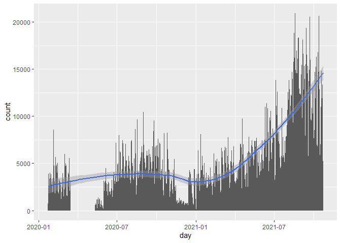
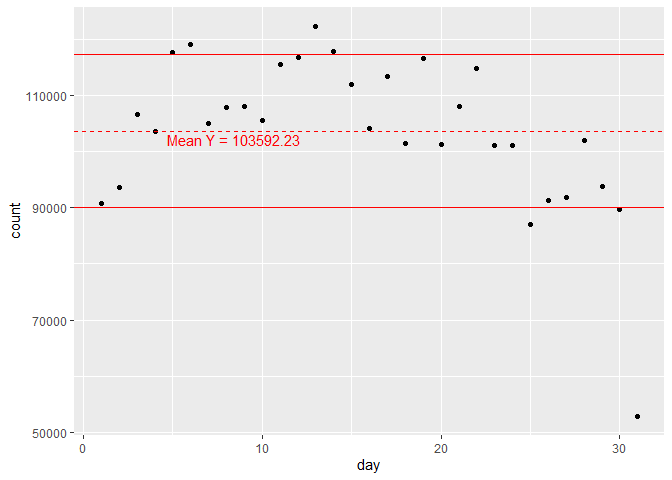
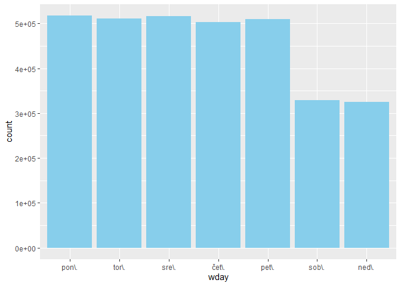

Slovenske železnice train delay
================

- [Data import](#data-import)
- [Network visualization](#network-visualization)
- [Representation of data](#representation-of-data)
  - [Basic statisctics](#basic-statisctics)
- [TODO](#todo)
  - [Distribution of Delays](#distribution-of-delays)
  - [Trend Analysis](#trend-analysis)
  - [Heatmap of Delays by Hour and Day of
    Week](#heatmap-of-delays-by-hour-and-day-of-week)
  - [Predictive Analysis](#predictive-analysis)
  - [Outlier Detection](#outlier-detection)

## Data import

Data import and preprocessing.

Data accessible on <https://www.kaggle.com/datasets/gregorkrz/szdelays>

``` r
delays <- read_csv(unzip("train_delay.zip", "delays.csv"))
rail_edge <- read_csv(unzip("train_delay.zip", "rail_edgelist.csv"), col_names = FALSE)
rail_node <- read_csv(unzip("train_delay.zip", "rail_nodes.csv"))

# transform node and edge data to character
rail_node$id <- as.character(rail_node$id)
rail_edge$X1 <- as.character(rail_edge$X1)
rail_edge$X2 <- as.character(rail_edge$X2)
delays$station_id <- as.character(delays$station_id)

# add 0 at begining for 4 letter edges to match the rest
rail_edge$X1[nchar(rail_edge$X1)==4] <- rail_edge$X1[nchar(rail_edge$X1)==4] %>% paste0("0",.)
rail_edge$X2[nchar(rail_edge$X2)==4] <- rail_edge$X2[nchar(rail_edge$X2)==4] %>% paste0("0",.)

# convert unix timestamp to datetime and add day column
delays$timestamp <- delays$timestamp %>% as_datetime()
delays <- delays %>% mutate(day=as.Date(timestamp))

# all dates in interval
all_days <- as.data.frame(seq.Date(date(min(delays$timestamp)),date(max(delays$timestamp)), by= "days"))
colnames(all_days) <- c("day")
missing_dates <- all_days %>% anti_join(delays)
all_missing_days <- as.data.frame(seq.Date(date(min(missing_dates$day)),date(max(missing_dates$day)), by= "days"))
colnames(all_missing_days) <- c("day")
# all missing dates are present in one interval
all(missing_dates == all_missing_days) # TRUE
```

## Network visualization

Visualization of network on map of Slovenia

``` r
# make graph from dataframe and back to get desired dataframe format
g <- graph.data.frame(rail_edge, directed=FALSE, vertices=rail_node)
gg <- as_data_frame(g, "both")
vert <- gg$vertices
coordinates(vert) <- ~lng+lat
edges <- gg$edges

# get spatialLines from edges
edges <- lapply(1:nrow(edges), function(i) {
  as(rbind(vert[vert$name == edges[i, "from"], ], 
           vert[vert$name == edges[i, "to"], ]), 
     "SpatialLines")
})

# change SpatialLines IDs
for (i in seq_along(edges)) {
  edges[[i]] <- spChFIDs(edges[[i]], as.character(i))
}

edges <- do.call(rbind, edges)

# visualize network
leaflet(vert) %>% addTiles() %>% 
  addCircleMarkers(
    data = vert,
    radius = 2,
    color = "blue", 
    fill = TRUE, 
    fillOpacity = 1, 
    opacity = 1) %>%
  addPolylines(
    data = edges, 
    color = "red",
    weight = 2)
```

<!-- -->

## Representation of data

Data is obtained at time intervals from 2020-01-23 to 2021-10-23. There
is a 57 day gap in data in interval 2020-03-16 to 2020-05-11, most
likely due to corona virus pandemic.

### Basic statisctics

Basic statistics for all trains.

``` r
delays$delay %>% summary()
```

    ##    Min. 1st Qu.  Median    Mean 3rd Qu.    Max. 
    ##    0.00    6.00   10.00   15.69   17.00  999.00

Since I still have hope for Slovenian railroads lets filter out all rows
with 16.65 hour (999 minute) delay from our data set and hope that those
2427 rows were mistake.

``` r
filtered <- delays %>%
  filter(delay!=999)

filtered$delay %>% summary()
```

    ##    Min. 1st Qu.  Median    Mean 3rd Qu.    Max. 
    ##    0.00    6.00   10.00   14.95   17.00  446.00

Next let’s determine the percentile of train that arrieved to station
with delay.

``` r
filtered[filtered$delay > 0,] %>% nrow() %>% {./nrow(filtered)}
```

    ## [1] 0.9964833

Again I hope this is error in data set and trains are not late in
0.996483253618338% of time. So let’s filter out rows without delay and
continue with this data.

``` r
filtered <- filtered %>%
  filter(delay!=0)

filtered$delay %>% summary()
```

    ##    Min. 1st Qu.  Median    Mean 3rd Qu.    Max. 
    ##       1       6      10      15      17     446

# TODO

### Distribution of Delays

``` r
time_delays <- delays %>% 
  group_by(day) %>%
  summarise(count=n())

time_delays %>% ggplot(aes(x=day,y=count)) +
  geom_col()+
  geom_smooth(formula = y ~ x) 
```

    ## `geom_smooth()` using method = 'loess'

<!-- -->

``` r
month_delay <- delays %>%
  group_by(month=month(timestamp)) %>%
  summarise(count=n())

month_delay %>% ggplot(aes(x=month,y=count)) +
  geom_point()
```

<!-- -->

``` r
day_delay <- delays %>%
  group_by(day=day(timestamp)) %>%
  summarise(count = n())

mean_y <- mean(day_delay$count)
sd_y <- sd(day_delay$count)


day_delay %>% ggplot(aes(x=day,y=count)) +
  geom_point() + 
  geom_hline(yintercept = mean_y, color = "red", linetype = "dashed") +
  annotate("text", x = min(day_delay$day), y = mean_y-1500, 
           label = paste("Mean Y =", round(mean_y, 2)), color = "red", hjust = -0.5) +
  geom_hline(yintercept = mean_y + sd_y, color = "red") +
  geom_hline(yintercept = mean_y - sd_y, color = "red")
```

<!-- -->

``` r
wday_delay <- delays %>% 
  group_by(wday=wday(timestamp,label=T, week_start = 1)) %>%
  summarise(count=n())

wday_delay %>% ggplot(aes(x=wday,y=count)) +
  geom_bar(stat = "identity", fill = "skyblue")
```

<!-- -->

``` r
hour_delays <- delays %>% 
  group_by(hour=hour(timestamp)) %>% 
  summarise(count=n())

mean_y <- mean(hour_delays$count)
mean_x <- mean(hour_delays$hour)
sd_x <- sd(hour_delays$hour)

hour_delays %>% ggplot(aes(x=hour,y=count)) +
  geom_point() + 
  geom_hline(yintercept = mean_y, color = "red", linetype = "dashed") +
  annotate("text", x = min(hour_delays$hour), y = mean_y-8000, 
           label = paste("Mean Y =", round(mean_y, 2)), color = "red", hjust = -0.5) +
  geom_vline(xintercept = mean_x - sd_x, color = "blue") +
  annotate("text", x = mean_x, y = 0, label = paste("Standard deviation"), color = "blue") +
  geom_vline(xintercept = mean_x + sd_x, color = "blue")
```

<!-- -->

### Trend Analysis

### Heatmap of Delays by Hour and Day of Week

### Predictive Analysis

### Outlier Detection
